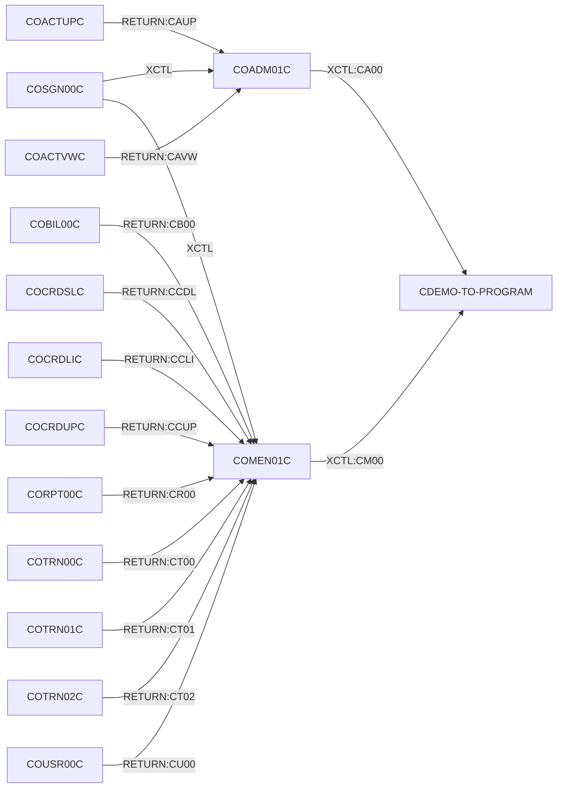
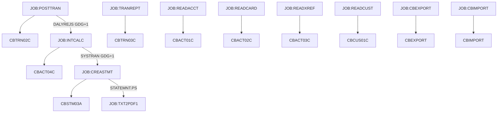
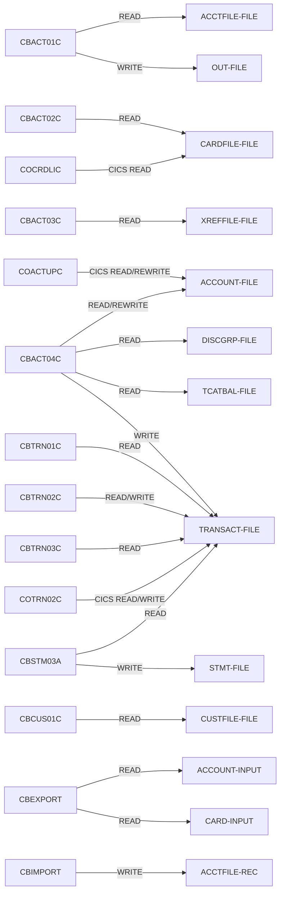

**Primary AI Agent:** Claude (Anthropic) via claude.ai

# CardDemo Mainframe Modernization Pipeline

COBOL modernization pipeline for the UST CodeCrafter Championship.  
Parses the [AWS CardDemo corpus](https://github.com/aws-samples/aws-mainframe-modernization-carddemo) using ProLeap and produces structured artifacts for LLM-assisted spec generation and forward engineering.

---

## Parse Coverage

| Source | Files | Parsed | Rate | Notes |
|---|---|---|---|---|
| COBOL (.cbl) | 39 | 38 | 97.4% | 31 main + 8 extension |
| JCL (.jcl) | 43 | 43 | 100% | 38 main + 5 extension |
| BMS (.bms) | 19 | 19 | 100% | 17 main + 2 extension |
| CSD (.csd) | 2 | 2 | 100% | 1 main + 1 extension |
| ASM (.asm) | 2 | 2 | 100% | MVSWAIT + COBDATFT |
| **Overall** | **105** | **104** | **99.0%** | |

**Only failure:** `COACTUPC.cbl` — template placeholders (TESTVAR1), correctly rejected by ProLeap.

---

## Architecture

```
CardDemo Corpus (39 COBOL + extension module)
         |
         v
[Copybook Preprocessor]  resolves COPY + provenance tracking (75 copybooks)
         |
         v
[ProLeap COBOL Parser]   ANTLR4-based, Java subprocess
         |
         v
Layer 1: AST              664 nodes, stable SHA-256 UUIDs
Layer 2: Symbols          8,126 symbols + 626 paragraphs
Layer 3: EXEC CICS/DLI   150 CICS statements + 52 DLI + 4 MQ
Layer 4: Graphs           Call(57) + File I/O(245) + TxFlow(53) + CFG(761) + IMS(52)
Layer 5: Analysis         Def-use(3,403) + Business rules(887)
Layer 6: Resources        BMS(441 fields) + CSD(21 transactions) + VSAM(8) + DB2(3) + IMS(4)
Layer 7: Coverage         97.4% parse rate + dead code(138) + clone report(4 pairs)
Layer 8: Forward Eng.     Canonical IR(38 programs) + 8 bounded contexts + Java emitter
         |
         v
DuckDB (17 tables, all layers queryable)
         |
         v
FastAPI REST (25+ endpoints + Swagger UI + CFG Visualizer + Graph Explorer)
         |
         v
LLM Spec Generation   grounded citations: [UUID:xxx][LINE:xxx]
LLM Forward Eng.      Java Spring Boot with BigDecimal + RoundingMode.HALF_EVEN
```

---


## Java + Maven Installation (Windows)

**Install JDK 17:**
1. Download from https://adoptium.net/temurin/releases/?version=17
2. Select Windows / x64 / JDK / 17 — download `.msi`
3. Run installer — PATH is set automatically

**Install Maven:**
1. Download from https://maven.apache.org/download.cgi
2. Unzip to `C:\maven`
3. Add `C:\maven\bin` to system PATH:

```powershell
[Environment]::SetEnvironmentVariable("Path", $env:Path + ";C:\maven\bin", "Machine")
```

4. Restart terminal and verify: `mvn --version`

---

---

## Prerequisites

| Tool | Version | Purpose |
|---|---|---|
| Python | 3.14.3 | Pipeline code |
| Java JDK | 17+ | Required to build + run ProLeap |
| Maven | 3.9+ | Required to build ProLeap from source |
| Git | Any | Clone repos |

### Verify prerequisites

```powershell
python --version    # Python 3.11+
java --version      # openjdk 17+
javac --version     # javac 17+
mvn --version       # Apache Maven 3.9+
git --version
```


---

---

## Installation Guide

### Step 1 — Clone this repo

```powershell
git clone --recurse-submodules https://github.com/292250-UST/mainframe-modernization mainframe-modernization
cd mainframe-modernization
```

### Step 2 — Verify CardDemo corpus

```powershell
dir corpus\app\cbl\
# Should show CBACT01C.cbl, COTRN02C.cbl, etc. (31 files)
dir corpus\app\app-authorization-ims-db2-mq\cbl\
# Should show COPAUA0C.cbl, COPAUS0C.cbl, etc. (8 extension files)
```

### Step 3 — Set up Python virtual environment

```powershell
python -m venv .venv
Set-ExecutionPolicy Unrestricted -Scope Process  # Windows only
.venv\Scripts\activate        # Windows
# source .venv/bin/activate   # Mac/Linux

pip install -r requirements.txt
```

Verify:
```powershell
python -c "import duckdb, fastapi, openai; print('deps OK')"
```

### Step 4 — Clone and build ProLeap COBOL parser

```powershell
# ProLeap is already a submodule — just build it
cd third_party\proleap-cobol-parser
mvn clean package -DskipTests
mvn dependency:copy-dependencies -DoutputDirectory=target\dependency
cd ..\..
```

Verify:
```powershell
dir third_party\proleap-cobol-parser\target\proleap-cobol-parser-4.0.0.jar
```

### Step 5 — Build the Java wrapper

```powershell
javac -cp "third_party\proleap-cobol-parser\target\proleap-cobol-parser-4.0.0.jar;third_party\proleap-cobol-parser\target\dependency\*" third_party\cobol-parser-wrapper\CobolParserWrapper.java -d third_party\cobol-parser-wrapper\
```

Verify:
```powershell
dir third_party\cobol-parser-wrapper\CobolParserWrapper.class
```

### Step 6 — Configure paths

`config.py` at project root — verify paths are correct:

```python
from pathlib import Path
ROOT = Path(__file__).parent
PROLEAP_JAR  = ROOT / "third_party" / "proleap-cobol-parser" / "target" / "proleap-cobol-parser-4.0.0.jar"
WRAPPER_DIR  = ROOT / "third_party" / "cobol-parser-wrapper"
CORPUS_DIR   = ROOT / "corpus"
COPYBOOK_DIR = ROOT / "corpus" / "app" / "cpy"
OUT_DIR      = ROOT / "out"
```

### Step 7 — Set LLM API key

```powershell
# Copy example and add your key
cp .env.example .env
```

Edit `.env`:
```
OPENAI_API_KEY=sk-your-key-here
```

Or set as environment variable:
```powershell
$env:OPENAI_API_KEY = "sk-xxx"   # Windows
# export OPENAI_API_KEY="sk-xxx" # Mac/Linux
```

> Note: LLM key is only required for `GET /spec/{program}` and `GET /forward/{program}` endpoints. All other endpoints work without it.

---

## Smoke Test

```powershell
python tests/test_proleap.py
```

Expected output:
```
Result: {'program': 'CBACT01C', 'status': 'ok'}
```

---

## Running the Pipeline

```powershell
# Run all steps end-to-end
python run_pipeline.py --step all

# Individual steps
python run_pipeline.py --step parse   # Parse all source files (COBOL+JCL+BMS+CSD+ASM)
python run_pipeline.py --step graph   # Build all graphs + extractors
python run_pipeline.py --step load    # Load into DuckDB (drops + recreates)
python run_pipeline.py --step ir      # Build canonical IR (Layer 8, 38 programs)
python run_pipeline.py --step spec    # Pre-generate LLM specs (cached)
python run_pipeline.py --step api     # Start REST API (port 8000)
```

---

## API Endpoints

### Core (required by brief)
| Endpoint | Description |
|---|---|
| GET /health | Health check |
| GET /coverage | Parse coverage report (Layer 7) |
| GET /program/{name} | Program metadata + UUID |
| GET /paragraph/{uuid} | Paragraph AST + CFG + rules + statements |
| GET /dataitem/{uuid} | Data definition with canonical type |
| GET /callers/{name} | Call graph — who calls this |
| GET /callees/{name} | Call graph — what this calls |
| GET /controlflow/{name} | CFG edges (JSON) |
| GET /defuse/{program} | Def-use chains grouped by variable |
| GET /businessrules/{name} | IF/EVALUATE rule catalog |
| GET /fileaccesses/{name} | File I/O operations |
| GET /transactionflow/{transid} | CICS navigation graph |
| GET /jobchain/{name} | JCL dependency chain |
| GET /copybookconsumers/{name} | Copybook usage |

### Specification & Forward Engineering
| Endpoint | Description |
|---|---|
| GET /spec/{program} | LLM spec generation (grounded, cached) |
| GET /spec/{program}?refresh=true | Force regenerate spec |
| GET /slice/{program} | LLM context slice (Rule 1 verification) |
| GET /forward/{program}?target=java | Java Spring Boot forward engineering |
| GET /forward/{program}?target=python | Python forward engineering |
| GET /seams | Architectural seam analysis (8 bounded contexts) |
| GET /testseeds/{program} | Test seed corpus from PIC + predicates |

### Optional Modules
| Endpoint | Description |
|---|---|
| GET /db2 | DB2 DDL schema (3 tables) |
| GET /ims | IMS DLI statements (52) |
| GET /ims?program=COPAUA0C | Filter by program |
| GET /mq | MQ access graph (4 calls) |
| GET /vsam | VSAM file schemas (8 files) |
| GET /gdg | GDG registry (7 bases) |
| GET /dataformats/{program} | Advanced data format breakdown |

### Visualization & Navigation
| Endpoint | Description |
|---|---|
| GET /cfg/{program} | **Interactive CFG visualizer (HTML, live)** |
| GET /explore | All programs entry point |
| GET /explore/{program} | **D3.js interactive artifact graph explorer** |
| GET /retrieve/{uuid} | Universal UUID resolver (all 10 tables) |
| GET /connectivity/{program} | Full connectivity summary |

---

## Visual Tools

### CFG Visualizer — `GET /cfg/{program}`
Interactive SVG control flow graph — paragraphs as nodes, PERFORM edges as arrows.
Live from DuckDB. Open directly in browser.

```
http://localhost:8000/cfg/COTRN02C
→ 18 paragraphs, 56 CFG edges, color-coded by edge type
```

### Graph Explorer — `GET /explore/{program}`
D3.js force-directed interactive artifact graph. All artifact types as colored nodes:

| Color | Node Type |
|---|---|
| 🔵 Blue | Programs |
| 🟣 Purple | Paragraphs |
| 🟢 Green | Symbols |
| 🟡 Amber | Business Rules |
| 🩵 Cyan | JCL Jobs |
| 🩷 Pink | IMS Segments |
| 🟡 Yellow | MQ Queues |
| 🟠 Orange | CICS Statements |
| 🟤 Violet | Copybooks |

**Interactions:**
- **Single click** → inspect UUID, properties, source line, action buttons
- **Double click** → expand connected nodes (loads from API)
- **Drag** → pin node in place
- **Legend click** → filter graph by node type (dims others)
- **↺ button** → unpin all nodes, restart layout
- **⌂ button** → reset zoom
- **☰ button** → toggle sidebar panel

```
http://localhost:8000/explore           ← all 38 programs entry point
http://localhost:8000/explore/COTRN02C  ← Transaction Add full artifact graph
http://localhost:8000/explore/COPAUA0C  ← IMS+MQ extension program graph
http://localhost:8000/explore/CBTRN02C  ← Batch program + JCL chain
```

Every node has a **Retrieve Artifact** button → calls `GET /retrieve/{uuid}` to verify source location.

---

## Key Metrics

| Metric | Value |
|---|---|
| COBOL programs parsed | 38/39 (97.4%) |
| Total symbols | 8,126 |
| Total paragraphs | 626 |
| Def-use chains | 3,403 |
| CFG edges | 761 |
| Business rules | 887 (774 IF + 113 EVALUATE) |
| EXEC CICS statements | 150 (19 verbs) |
| EXEC DLI statements | 52 (9 verbs) |
| MQ calls | 4 |
| Call graph edges | 57 (31 CALL + 26 XCTL) |
| File I/O operations | 245 |
| Transaction flow edges | 53 |
| DuckDB tables | 17 |
| Canonical IR programs | 38 (Layer 8) |
| Bounded contexts (seams) | 8 |
| Clone pairs detected | 4 |
| Empty paragraphs (dead code) | 138 |

---

## Demo A — Online Program (COTRN02C)

Transaction Add screen — complexity=55, 18 paragraphs, 1,160 lines.

```bash
# Generate grounded spec
curl http://localhost:8000/spec/COTRN02C

# Inspect LLM context (Rule 1 verification — no raw COBOL)
curl http://localhost:8000/slice/COTRN02C

# Forward engineer to Java
curl "http://localhost:8000/forward/COTRN02C?target=java"

# Interactive graph explorer
open http://localhost:8000/explore/COTRN02C
```

Sample grounded claim from generated spec:
> "MAIN-PARA [UUID:994395d163f4caca58c1703e6c4188ec][LINE:107] controls execution
> and validates EIBCALEN [UUID:919580a49b614b699b366ba9d0777c2b][LINE:115]"

Verify any UUID: `GET /retrieve/994395d163f4caca58c1703e6c4188ec`

---

## Demo B — Batch Chain (POSTTRAN → INTCALC → CREASTMT)

```bash
curl http://localhost:8000/jobchain/POSTTRAN
curl http://localhost:8000/spec/CBTRN02C
curl http://localhost:8000/spec/CBACT04C
curl "http://localhost:8000/forward/CBSTM03A?target=java"
```

End-to-end data lineage:
```
DALYTRAN input
  -> CBTRN02C validates + posts  -> TCATBALF updated
  -> CBACT04C computes interest  -> TRANSACT updated
  -> CBSTM03A generates statements -> STATEMNT.PS
```

---

## Known Gaps (Honest Reporting)

| Gap | Reason | Impact |
|---|---|---|
| COACTUPC.cbl fails | Template placeholders (TESTVAR1) | 1 program without AST — documented |
| screen_map table empty | BMS→program cross-link not implemented | Layer 4 gap |
| migration_risk table empty | Data exists in artifacts, not aggregated | Layer 7 gap |
| predicate_resolved empty | Symbol resolution during rule extraction not built | Layer 5 gap |
| Slicing index | Backward dataflow analysis not implemented | Layer 3 gap |
| Arithmetic spec | COMPUTE expression tree not normalized | Layer 5 gap |
| EXEC SQL | 0 occurrences in corpus — DB2 via DDL only | Verified by grep |
| JCL PROC/IF/INCLUDE | 0 occurrences in corpus — regex parser used | 100% coverage |
| Dead code (178 paras) | Fall-through reachability not tracked | 138 confirmed empty reported |
| Clone report | Structural fingerprint only — no AST diffing | 4 pairs found |

---

## Repository Structure

```
mainframe-modernization/
│
├── corpus/                          # AWS CardDemo source (git submodule)
│   └── app/
│       ├── cbl/                     # 31 COBOL programs (main)
│       ├── cpy/                     # 66 copybooks + generated stubs
│       ├── jcl/                     # 38 JCL batch jobs
│       ├── bms/                     # 17 BMS screen maps
│       ├── csd/                     # 1 CSD file (CARDDEMO.CSD)
│       ├── asm/                     # 2 Assembler stubs
│       └── app-authorization-ims-db2-mq/  # Extension module
│           ├── cbl/                 # 8 extension COBOL programs
│           ├── cpy/                 # 9 extension copybooks
│           ├── jcl/                 # 5 extension JCL files
│           ├── bms/                 # 2 extension BMS maps
│           ├── csd/                 # 1 extension CSD (CRDDEMO2.csd)
│           ├── ims/                 # 4 IMS DBD + 4 PSB files
│           └── ddl/                 # 6 DB2 DDL files
│
├── third_party/
│   ├── proleap-cobol-parser/        # ProLeap source (git submodule)
│   └── cobol-parser-wrapper/        # Thin Java wrapper
│       ├── CobolParserWrapper.java
│       └── CobolParserWrapper.class
│
├── src/
│   ├── parsers/                     # COBOL, JCL, BMS, CSD, ASM parsers
│   │   ├── batch_parser.py
│   │   ├── jcl_parser.py
│   │   ├── bms_parser.py
│   │   ├── csd_parser.py
│   │   ├── exec_cics_extractor.py
│   │   ├── exec_dli_extractor.py
│   │   ├── db2_ddl_parser.py
│   │   └── ims_dbd_parser.py
│   ├── preprocess/                  # Copybook resolver + provenance tracker
│   ├── layers/
│   │   ├── l1_ast/                  # AST nodes + transformer
│   │   ├── l2_symbols/              # Symbol table + type system
│   │   ├── l4_system_graphs/        # CFG, call graph, transaction flow
│   │   └── l8_ir/                   # Canonical IR (Layer 8)
│   │       └── canonical_ir.py
│   ├── storage/                     # DuckDB schema + loader
│   │   ├── schema.sql
│   │   └── loader.py
│   ├── api/                         # FastAPI REST (25+ endpoints)
│   │   └── main.py
│   └── llm/                         # Artifact retrieval + spec/forward generator
│       ├── retrieval.py
│       └── spec_generator.py
│
├── scripts/                         # Utility scripts
│   ├── corpus_tally.py
│   ├── optional_modules_tally.py
│   ├── verify_output_format.py
│   ├── build_dead_code_report.py
│   ├── build_clone_report.py
│   └── build_vsam_schemas.py
│
├── tests/
│   └── test_proleap.py              # Smoke test
│
├── out/                             # Generated artifacts (git-ignored)
│   ├── artifacts/
│   │   ├── layer1/                  # AST JSON (30 files)
│   │   ├── layer2/                  # Symbols + paragraphs JSON
│   │   ├── layer3/                  # CICS/DLI/MQ statements
│   │   ├── layer4/                  # Graphs JSON
│   │   ├── layer5/                  # Business logic JSON
│   │   ├── layer6/                  # Resource definitions JSON
│   │   ├── layer7/                  # Coverage + dead code + clone reports
│   │   ├── layer8/                  # Canonical IR JSON (38 programs)
│   │   ├── layer1_ext/              # Extension module AST
│   │   ├── layer2_ext/              # Extension module symbols
│   │   └── layer6_ext/              # Extension module resources
│   ├── graph/                       # artifacts.duckdb (17 tables)
│   └── demo/                        # Generated specs + forward engineering
│
├── .env.example                     # Required environment variables
├── config.py                        # All paths — no hardcoding
├── requirements.txt
├── run_pipeline.py                  # One-command pipeline orchestrator
└── README.md
```

---

## Tech Stack

| Component | Technology |
|---|---|
| COBOL Parser | ProLeap 4.0.0 (ANTLR4, Java) |
| Storage | DuckDB 1.5.2 |
| API | FastAPI 0.135.3 + uvicorn |
| LLM | OpenAI API (gpt-4o-mini) |
| CFG Visualizer | SVG/D3 (self-contained HTML, live from DuckDB) |
| Graph Explorer | D3.js force-directed (interactive, live from DuckDB) |
| Forward Eng. | Java Spring Boot (BigDecimal + RoundingMode.HALF_EVEN) |
| Python | 3.14.3 |


---

## Known Issues

| Issue | Cause | Status |
|---|---|---|
| `COACTUPC.cbl` fails to parse | Template placeholders (TESTVAR1) | Known — in coverage report |
| ProLeap INFO logs in terminal | ProLeap uses SLF4J logging by design | Expected — not errors |
| Double log lines in pipeline | Python logging initialized twice | Cosmetic only — data loads once correctly |

---

## Mermaid Diagrams

Generated from live DuckDB artifact store. Regenerate: `python scripts/generate_mermaid.py`

| Diagram | File | Edges |
|---|---|---|
| Call graph | [docs/mermaid/call_graph.mmd](docs/mermaid/call_graph.mmd) | 38 |
| Transaction flow | [docs/mermaid/transaction_flow.mmd](docs/mermaid/transaction_flow.mmd) | 21 |
| JCL job chain | [docs/mermaid/jcl_chain.mmd](docs/mermaid/jcl_chain.mmd) | 10 |
| File I/O graph | [docs/mermaid/file_io.mmd](docs/mermaid/file_io.mmd) | 145 |

### 1. Call Graph

```mermaid
graph TD
    CBACT01C --> COBDATFT
    CBACT01C --> CEE3ABD
    CBACT02C --> CEE3ABD
    CBACT03C --> CEE3ABD
    CBACT04C --> CEE3ABD
    CBCUS01C --> CEE3ABD
    CBEXPORT --> CEE3ABD
    CBIMPORT --> CEE3ABD
    CBSTM03A -->|CALL x13| CBSTM03B
    CBSTM03A --> CEE3ABD
    CBTRN01C --> CEE3ABD
    CBTRN02C --> CEE3ABD
    CBTRN03C --> CEE3ABD
    COBSWAIT --> MVSWAIT
    COSGN00C -->|XCTL| COADM01C
    COSGN00C -->|XCTL| COMEN01C
    COACTUPC -->|XCTL| CDEMO-TO-PROGRAM
    COACTVWC -->|XCTL| CDEMO-TO-PROGRAM
    COADM01C -->|XCTL| CDEMO-TO-PROGRAM
    COBIL00C -->|XCTL| CDEMO-TO-PROGRAM
    COCRDLIC -->|XCTL| CCARD-NEXT-PROG
    COCRDSLC -->|XCTL| CDEMO-TO-PROGRAM
    COCRDUPC -->|XCTL| CDEMO-TO-PROGRAM
    COMEN01C -->|XCTL| CDEMO-TO-PROGRAM
    CORPT00C -->|CALL| CSUTLDTC
    CORPT00C -->|XCTL| CDEMO-TO-PROGRAM
    COTRN00C -->|XCTL| CDEMO-TO-PROGRAM
    COTRN01C -->|XCTL| CDEMO-TO-PROGRAM
    COTRN02C -->|CALL| CSUTLDTC
    COTRN02C -->|XCTL| CDEMO-TO-PROGRAM
    COUSR00C -->|XCTL| CDEMO-TO-PROGRAM
    COUSR01C -->|XCTL| CDEMO-TO-PROGRAM
    COUSR02C -->|XCTL| CDEMO-TO-PROGRAM
    COUSR03C -->|XCTL| CDEMO-TO-PROGRAM
    CSUTLDTC --> CEEDAYS
```



### 2. Transaction Flow



### 3. JCL Job Chain



### 4. File I/O Graph



---

## Credits

| Tool | Source | License |
|---|---|---|
| ProLeap COBOL Parser | https://github.com/uwol/proleap-cobol-parser | MIT |
| AWS CardDemo Corpus | https://github.com/aws-samples/aws-mainframe-modernization-carddemo | Apache 2.0 |
| ANTLR4 | https://www.antlr.org | BSD |
| DuckDB | https://duckdb.org | MIT |
| FastAPI | https://fastapi.tiangolo.com | MIT |
